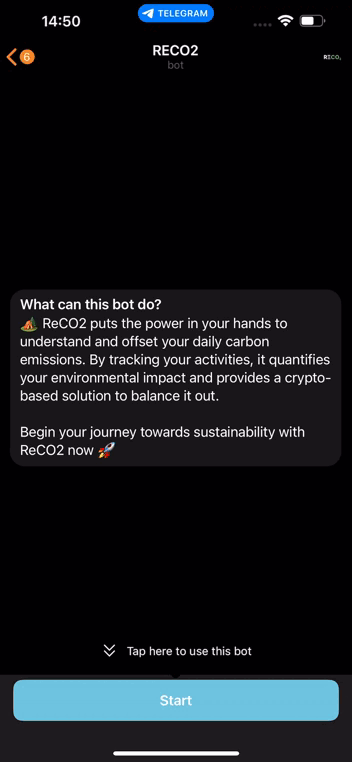

# ReCO2

ReCO2 is an innovative application that allows you to measure and offset your daily carbon footprint using cryptocurrency. This application turns everyday choices into opportunities to contribute to environmental conservation and aims to help in creating a greener future.

  

## Features

Activity Logging: Log your daily activities such as commuting, consumption habits, and more.
Carbon Footprint Calculation: Get instant calculations of your CO2 emissions based on your logged activities.
Crypto Offset: Connect your wallet and offset your carbon footprint using cryptocurrency.

## How to Use

1. Log your daily activities in the app.
1. Instantly calculate your CO2 emissions.
1. Connect your wallet (We've integrated MetaMask for seamless transactions) and offset your carbon emissions with crypto.

## Built With

- Node.js: Powers our server-side application, managing tasks like database interactions and API interfacing.
- React: Used for our client-side application, creating an interactive user interface.
- SQL Database: Manages data, including user information and transaction records.
- Telegram & MetaMask APIs: Enable integration with the Telegram messaging platform and non-custodial wallet management respectively.

## Challenges

The most significant challenge was developing a shop interface using the latest Telegram technology that interacts with non-custodial wallets. Coordinating different parts, such as fetching product data, displaying products, managing wallet transactions, while ensuring user-friendliness and security was complex.

## Conclusion

ReCO2 is more than just an app; it's a tool for environmental stewardship. Start your journey towards sustainability now!

## Contributing

We welcome contributions! Please feel free to make a pull request

## License

This project is licensed under the terms of the MIT license. See LICENSE for more information.
